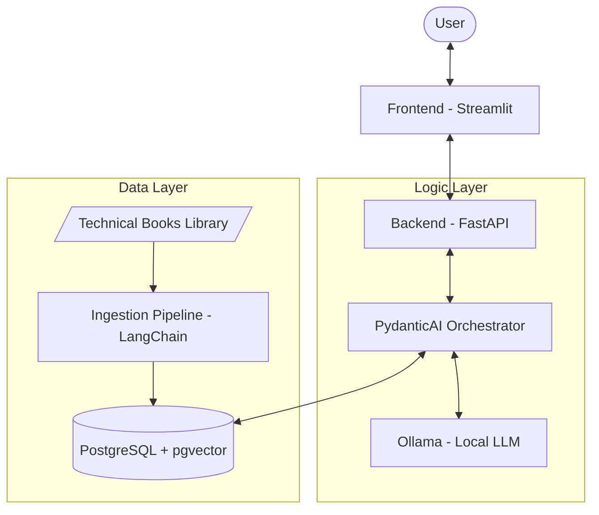

# Architecture Overview - PepoRAG

## System Architecture
This project follows a decoupled architecture, separating the presentation layer from the logic and data layers. All components are designed to run locally.

### Data Flow Diagram

## Component Descriptions

### 1. Presentation Layer (Frontend)
- **Technology:** Streamlit.
- **Role:** Provides a modern, responsive interface for users to ask questions, view results with citations, and manage their document library.

### 2. Logic Layer (Backend API)
- **Technology:** FastAPI.
- **Role:** Exposes RESTful endpoints for the frontend. Handles authentication (if local multi-user is needed) and triggers the RAG orchestration.

### 3. LLM Orchestration (PydanticAI)
- **Technology:** PydanticAI.
- **Role:** Manages the RAG flow. It handles tool calling, prompt templating, and ensures type-safe interactions with the LLM and the database.

### 4. Local Inference (Ollama)
- **Technology:** Ollama.
- **Role:** Serves as the local LLM provider. Runs models like Llama 3 or Mistral locally, ensuring zero data leakage to the cloud.

### 5. Data Layer (PostgreSQL + pgvector)
- **Technology:** PostgreSQL with the `pgvector` extension.
- **Role:** Stores both relational metadata (book titles, authors, paths) and vector embeddings for semantic search.

### 6. Ingestion Pipeline
- **Technology:** LangChain (exclusively for ingestion).
- **Role:** Handles the heavy lifting of parsing various document formats (PDF, EPub), chunking text, and generating embeddings to be stored in `pgvector`.

## Security & Privacy
- **100% Local:** All components run on the user's hardware.
- **No External APIs:** No calls to OpenAI, Anthropic, or other cloud LLM providers.
- **Data Persistence:** PostgreSQL data is stored locally, optionally within a Docker volume.
